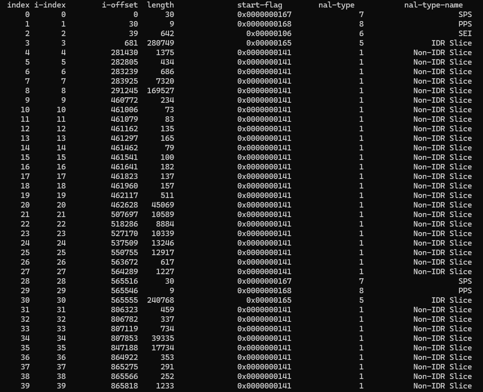
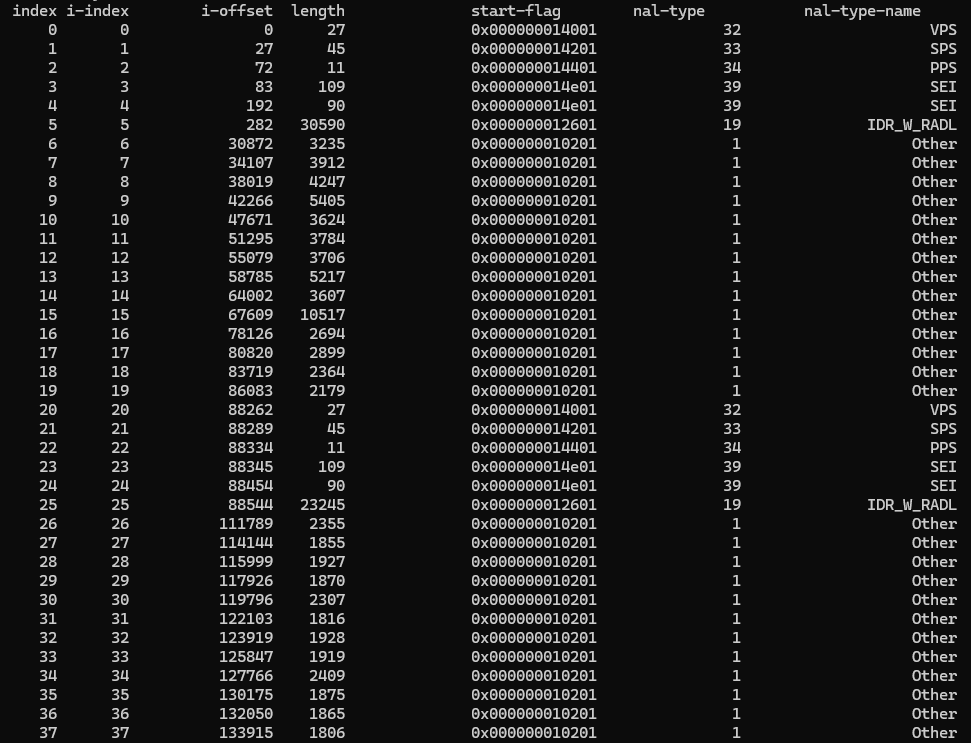

a lightweight tool to analyse h264 and h265 raw stream, written by native C++, easy to integrate into your code. please refer to `main.cpp`

## result for h264 ##
```
./stream_analyser video.h264 h264
```


## result for h265 ##
```
./stream_analyser video.h265 h265
```
